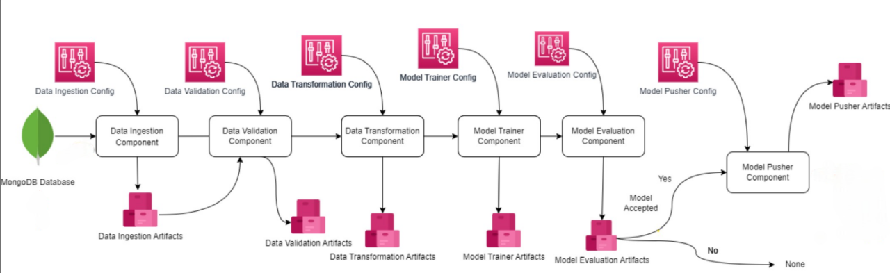
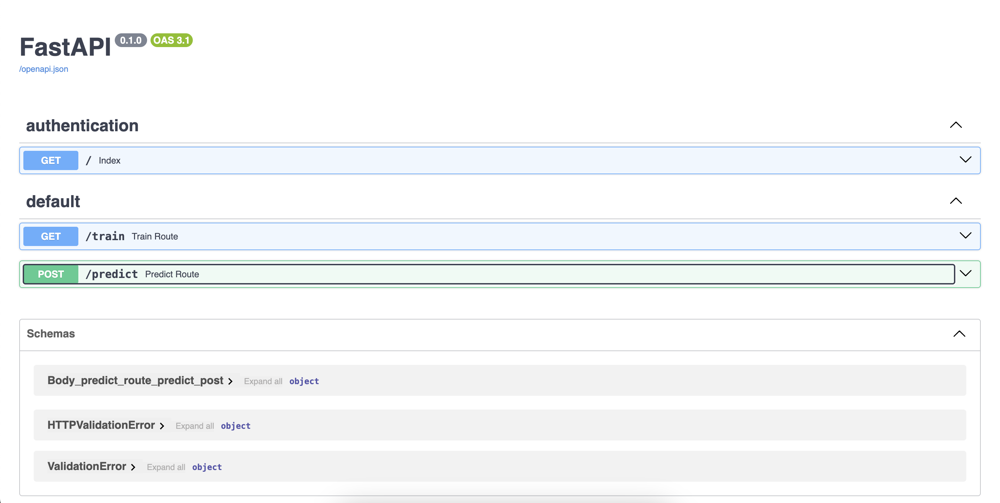

# **Network Security with MLOps**

This project focuses on applying **MLOps principles** to a **network security dataset**, demonstrating how to build an end-to-end machine learning pipeline that includes **data ingestion**, **validation**, **transformation**, **model training**, **evaluation**, and **deployment**.

The primary goal is to implement and learn MLOps practices using tools like **MongoDB**, **MLFlow**, **DagsHub**, **GitHub CI/CD**, **Docker**, **AWS S3**, **AWS ECR**, and **AWS EC2**.

---

## **Table of Contents**
1. [Project Overview](#project-overview)
2. [Tech Stack](#tech-stack)
3. [Workflow](#workflow)
4. [Features](#features)
5. [Setup Instructions](#setup-instructions)
6. [Deployment Details](#deployment-details)
7. [Future Enhancements](#future-enhancements)
8. [Acknowledgments](#acknowledgments)

---

## **1. Project Overview**

This project processes a **network security dataset** to build a machine learning model. The focus is on designing a **scalable pipeline** using **MLOps best practices** for data ingestion, model building, and deployment.

**Goals:**
- Implement an end-to-end MLOps pipeline.
- Automate workflows with CI/CD pipelines.
- Use cloud services for model deployment.
- Track experiments and artifacts using **MLFlow** and **DagsHub**.

---

## **2. Tech Stack**
- **Database**: MongoDB
- **Experiment Tracking**: MLFlow, DagsHub
- **Cloud Storage**: AWS S3
- **Model Deployment**: AWS ECR, AWS EC2
- **Containerization**: Docker
- **CI/CD**: GitHub Actions
- **Frameworks/Libraries**: Python (Pandas, Scikit-learn, FastAPI, Uvicorn)
---

## **3. Workflow**

### **Project Structure**


The pipeline includes:
1. **Data Ingestion**:
   - Fetches raw data from MongoDB.
   - Stores the raw dataset and split datasets (`train.csv`, `test.csv`).

2. **Data Validation**:
   - Ensures schema consistency and checks for data drift.
   - Generates validation reports as JSON.

3. **Data Transformation**:
   - Handles missing values and applies transformations.
   - Outputs preprocessed datasets (`train.npy`, `test.npy`).

4. **Model Training**:
   - Trains multiple models and selects the best one based on metrics.
   - Logs model metrics and artifacts to MLFlow.

5. **Model Evaluation**:
   - Compares the best model with a baseline.
   - If the model meets the criteria, it is marked for deployment.

6. **Model Deployment**:
   - Pushes the trained model (Docker Image) to AWS ECR.
   - Deploys the model on AWS EC2 for real-time predictions using GitHub Actions for CI/CD.

---

## **4. Features**
- Automated pipeline for data ingestion, validation, transformation, and model training.
- Experiment tracking using MLFlow and DagsHub.
- CI/CD pipeline with GitHub Actions.
- Containerization using Docker.
- Cloud-based deployment using AWS services.

---

## **5. Setup Instructions**
1. Clone the repository:
   ```bash
   git clone <repository_url>
2. Navigate to the project directory:
   ```bash
   cd network-security-project
3. Set up a virtual environment:
   ```bash
   python -m venv venv
   source venv/bin/activate
4. Install dependencies:
   ```bash
   pip install -r requirements.txt
5. Set up environment variables:
- Create a `.env` file with the following keys:
   ```bash
   MONGO_DB_URL = <your_mongo_db_url>
6. Add Repository Secrets in your GitHub repository under `Repository Settings/Secrets and variables/Actions`:

   ```bash
   AWS_ACCESS_KEY_ID = <your_aws_access_key>
   AWS_SECRET_ACCESS_KEY = <your_aws_secret_access_key>
   AWS_REGION = <your_aws_region>
   AWS_ECR_LOGIN_URI = <your_ecr_login_uri>
   ECR_REPOSITORY_NAME = <your_ecr_repository_name>
---

## **6. Deployment Details**

### **EC2 Deployment**

- Add this security rule in your EC2 instance under `Security/Security Groups/Edit Inbound Rules`:

   ```bash
   Type = Custom TCP 
   Port range = 8080
   Source = Custome (0.0.0.0/0)
- Connect to your EC2 instance and run these commands:
   ```bash
   sudo apt-get update -y
   ```
   ```bash
   sudo apt-get upgrade
   ```
   ```bash
   curl -fsSL https://get.docker.com -o get-docker.sh
   ```
    ```bash
   sudo sh get-docker.sh
   ```
   ```bash
   sudo usermod -aG docker ubuntu
   ```
   ```bash
   sudo usermod -aG docker ubuntu
   ```
   ```bash
   sudo apt-get upgrade
   ```
- Now create a new self-hosted runner, which can be found in: `Repository Settings/Actions/Runners`.
- Follow the commands of the environment type of your EC2 instance to create the runner.
- Now, the runner will be listening, so push your code to GitHub to run the entire pipeline.
- Finally, open your EC2 instance URL, `<your_ec2_url:8080>`, to use the system. 



## **7. Future Enhancements**

- Monitoring: Integrate AWS CloudWatch to monitor deployed models in real time.
- Orchestration: Use Kubernetes for better scalability and orchestration.
- Data Versioning: Implement DVC for tracking data changes and ensuring reproducibility.

## **8. Future Enhancements**

- Special thanks to [Krish Naik](https://github.com/krishnaik06) for his coding tutorials and insights into MLOps best practices.


